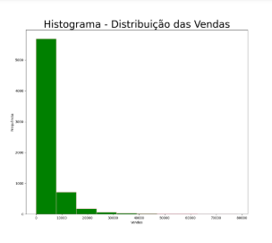
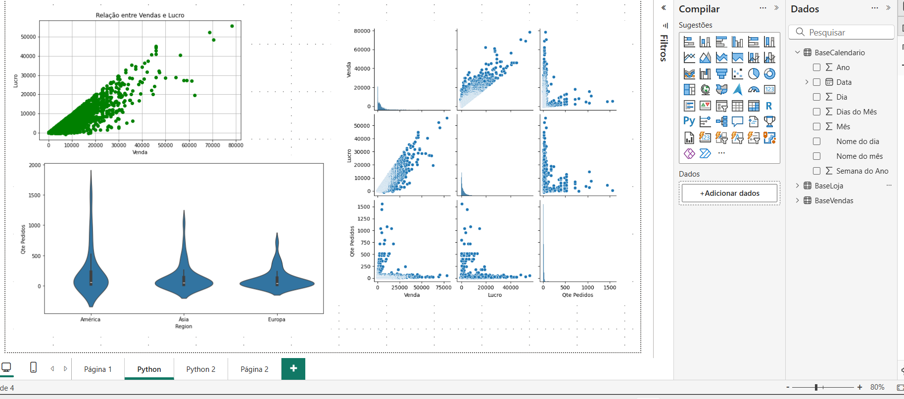
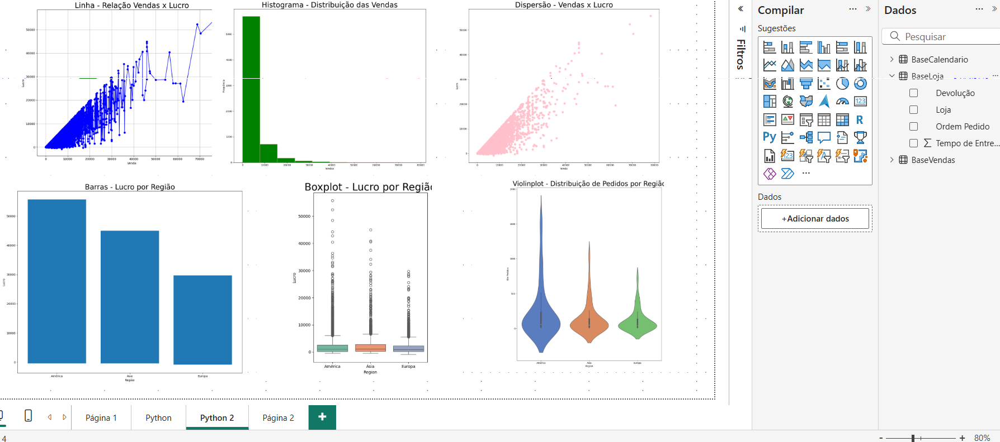
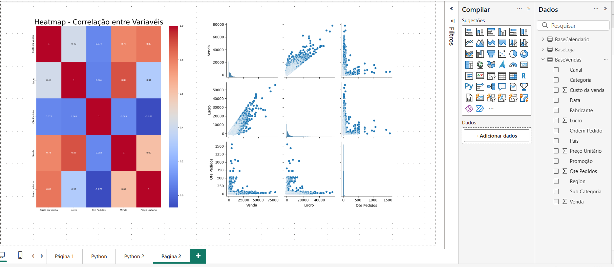

<p align="center">
  
</p>

# 📊 Projeto de BI em Python e Power BI

Este repositório contém um projeto de Business Intelligence (BI) desenvolvido com **Power BI** e **Python**, com o objetivo de integrar análises avançadas e visualizações interativas de dados.

---
## 🧠 Sobre o Projeto

O arquivo [📥 Baixar dashboard completo (.pbix)](Python_powerb_finalizado.pbix)
 contém **dashboards interativos** e páginas com visuais criados a partir de **scripts Python**.

Esses visuais permitem gerar análises estatísticas, dispersões, distribuições e correlações usando **matplotlib** e **seaborn** diretamente dentro do Power BI.

Foram utilizados scripts Python para gerar **8 visualizações**, incluindo:

As páginas incluem gráficos como:
- **Dispersão (scatterplot)** de Vendas x Lucro  
- **Violinplot** e **Boxplot** por Região  
- **Heatmap de correlação** entre variáveis  
- **Pairplot** para explorar relações entre indicadores  

---

## 🧰 Tecnologias Utilizadas

| Tecnologia | Finalidade |
|-------------|-------------|
| **Power BI Desktop** | Criação dos dashboards e integração com Python |
| **Python 3.x** | Execução de scripts e visualizações analíticas |
| **Matplotlib** | Geração de gráficos básicos e personalizados |
| **Seaborn** | Gráficos estatísticos e visual aprimorado |

---
## 📁 Estrutura do Repositório
```
Python_PowerBI/
│
├── dashboards/
│   └── Python_powerbi.pbix
│
├── imagens/
│   ├── pagina_python_1.png
│   ├── pagina_python_2.png
│   └── pagina_python_3.png
│
└── README.md
```

## 🚀 Como Usar

1. Baixe o repositório:
   ```bash
   git clone https://github.com/srasouza/Python_PowerBI.git
2.  Abra o arquivo no Power BI Desktop:
 [Python_powerbi.pbix](https://animaedu-my.sharepoint.com/:u:/r/personal/86475340502_ulife_com_br/Documents/Python_powerbi.pbix?csf=1&web=1&e=E3DitN)

3. Certifique-se de ter o Python instalado e configurado no Power BI:
- Vá em Arquivo → Opções e configurações → Opções → Scripts Python

- Informe o caminho do seu interpretador Python.

4. Instalação das bibliotecas Python

Antes de usar os visuais Python no Power BI, é necessário garantir que as bibliotecas estejam instaladas no ambiente Python configurado.

Neste projeto, usamos apenas duas bibliotecas:

matplotlib → para gráficos básicos (barras, linhas, dispersões)

seaborn → para gráficos estatísticos (violinplot, heatmap, boxplot, pairplot)

⚙️ O pandas já vem integrado ao Power BI, então não precisa instalá-lo manualmente.

## 🪟 Passo a passo para instalar as bibliotecas

No menu Iniciar do Windows, digite “Prompt de Comando”.

Clique com o botão direito em “Prompt de Comando” e escolha “Executar como administrador”.

Na janela que abrir, digite o comando abaixo e pressione Enter:

```
py -m pip install matplotlib 
```
Aguarde até o processo terminar.

Depois faça o mesmo com seaborn
```
py -m pip install seaborn
```
Quando aparecer a mensagem “Successfully installed”, significa que as bibliotecas foram instaladas corretamente ✅

## ✅ Teste dentro do Power BI

Após a instalação, abra o Power BI e adicione um visual de Script Python.
Cole o código abaixo para confirmar se está tudo funcionando:

import matplotlib.pyplot as plt
import seaborn as sns

sns.set(style="whitegrid")
plt.figure(figsize=(5,3))
sns.scatterplot(x="Venda", y="Lucro", data=dataset)
plt.title("Teste de Integração Python + Power BI")
plt.show()


Se o gráfico aparecer corretamente, o ambiente Python está configurado com sucesso 🎉

## 💡 Dica extra

Para eliminar os espaços em branco faça isso:

```
plt.tight_layout()

plt.show()
```

### Antes



### Depois


## 📸 Exemplos de Dashboards

### 🔹 Página Python 1


### 🔹 Página Python 2


### 🔹 Página Python 3


